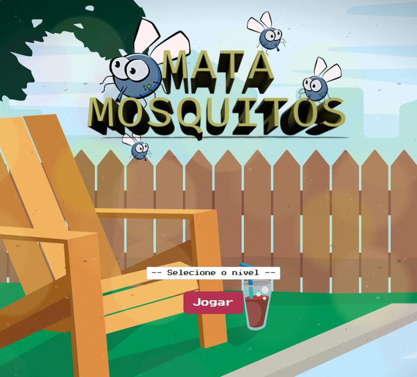

# Mata Mosquitos 🎮
 

 

 
 
 

 
 

 
 

Um divertido game desenvolvido para browser, contendo quatro níveis de dificuldade, utilizando:
* _Bootstrap_ para aplicar o estilo;
* _Javascript_ para captar as coordenadas da tela e renderizar os elementos animados com base no tempo estipulado pelo nível escolhido;
* Fontes: Press Start 2P by <a href="https://fonts.google.com/">_Google Fonts_</a>.

 
 

### @ManuCoutinho